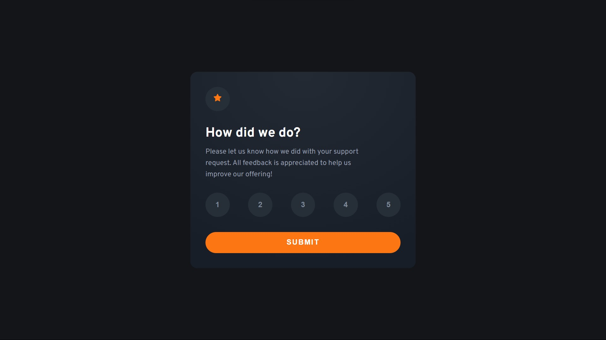
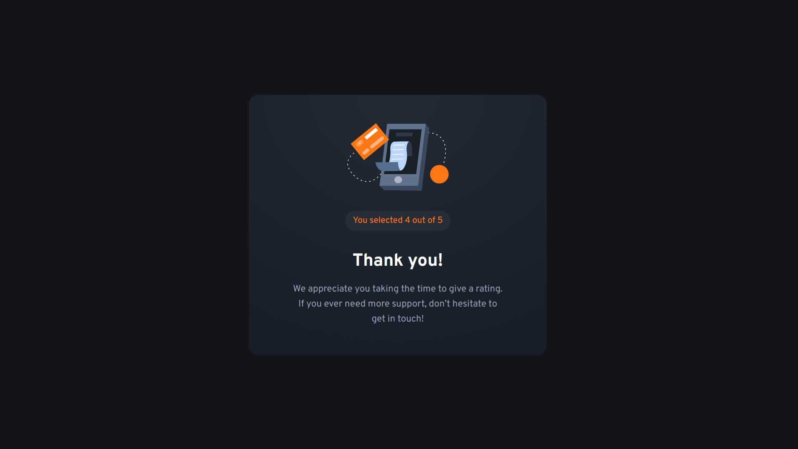

# Frontend Mentor - Interactive rating component solution

This is a solution to the [Interactive rating component challenge on Frontend Mentor](https://www.frontendmentor.io/challenges/interactive-rating-component-koxpeBUmI) built with React, TypeScript, Vite and SCSS. 

## Table of contents

- [Overview](#overview)
  - [The challenge](#the-challenge)
  - [Screenshot](#screenshot)
  - [Links](#links)
- [My process](#my-process)
  - [Built with](#built-with)
  - [What I learned](#what-i-learned)
  - [Continued development](#continued-development)
- [Author](#author)

## Overview

### The challenge

Users should be able to:

- View the optimal layout for the app depending on their device's screen size
- See hover states for all interactive elements on the page
- Select and submit a number rating
- See the "Thank you" card state after submitting a rating

### Screenshot




### Links

- [Solution URL](https://www.frontendmentor.io/solutions/interactive-rating-component-with-react-typescript-vite-and-scss-znOAE91Y_B)
- [Live Site URL](https://helsel-interactive-rating-component.netlify.app/)

## My process

### Built with

- Semantic HTML5 markup
- [SCSS](https://sass-lang.com/)
- [TypeScript](https://www.typescriptlang.org/)
- Flexbox
- Mobile-first workflow
- [React](https://reactjs.org/)
- [Vite](https://vitejs.dev/)

### What I learned

My big takeaway here is handling React props with TypeScript. In my previous project, I was frustrated that the only way I could declare and use them required a reference to the `props` object. I'm still dissatisfied with the amount of steps required but I'm moving in the right direction.

```js
interface RatingButtonProps {
  text: string;
  activeButton: string;
  setActiveButton: Function;
}

function RatingButton(props: RatingButtonProps) {
  const {text, activeButton, setActiveButton} = props;

  return (
    <button className={activeButton === text ? "selected" : ""} onClick={() => setActiveButton(text)}>
        {text}
    </button>
  )
}

export default RatingButton
```

### Continued development

I may come and toy with  dimensions again to get things a little more exact, but I largely feel done with this one.

## Author

- Website - [Jeremy Helsel](https://jeremyhelsel.com/)
- Frontend Mentor - [@JIH7](https://www.frontendmentor.io/profile/JIH7)